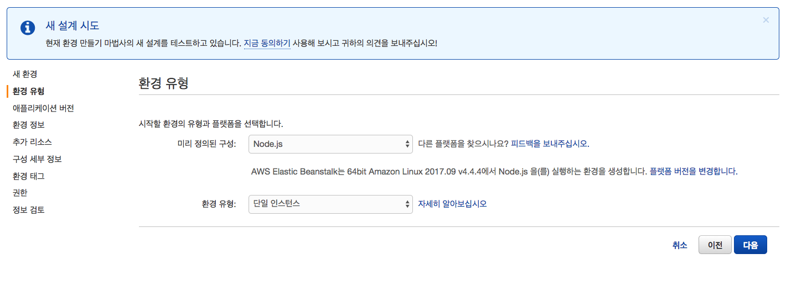

# AWS Elastic Beanstalk


## AWS Elastic Beanstalk란? 


* Elastic Beanstalk는 고급 배포 도구로서, 데스크탑의 앱을 몇 분 만에 웹으로 이동시킬 수 있습니다.
* Beanstalk는 용량 프로비저닝, 로드 밸런싱, 크기 조정, 애플리케이션 상태 모니터링 등의 호스팅 환경 세부 작업을 처리하므로 이러한 작업을 직접할 필요가 없습니다.
* Elastic Beanstalk는 Java, PHP, .NET, Node.js, Python, Ruby로 개발된 앱뿐만 아니라 각 언어에 대해 서로 다른 컨테이너 유형도 지원합니다.


* 기존 웹 애플리케이션을 배포하고, 애플리케이션 원본 번들을 생성하고 나서 새 애플리케이션을 생성할 수 있습니다. 
* Git를 사용하고 있고 이것을 명령줄 도구와 함께 사용하려면, EB CLI를 사용할 수 있습니다.

### 애플리케이션 소스번들 생성 
* AWS Elastic Beanstalk 콘솔을 사용하여 새 애플리케이션 또는 애플리케이션 버전을 배포할 경우 소스 번들을 업로드해야 합니다. 소스 번들은 다음 요구 사항을 충족해야 합니다.
	* 단일 ZIP 파일 또는 WAR 파일로 구성됩니다. ZIP 파일 내에 여러 WAR 파일을 포함할 수 있습니다.
	* 512MB를 초과해서는 안 됩니다.
	* 상위 폴더 또는 최상위 디렉터리를 포함해서는 안 됩니다(하위 디렉터리는 상관 없음).

### 명령줄에서 소스번들 생성 
* zip 명령을 사용하여 소스 번들을 만듭니다. 숨긴 파일과 폴더를 포함하려면 다음과 같은 패턴을 사용합니다.

```bash 
~/myapp$ zip ../myapp.zip -r * .[^.]*
  adding: app.js (deflated 63%)
  adding: index.js (deflated 44%)
  adding: manual.js (deflated 64%)
  adding: package.json (deflated 40%)
  adding: restify.js (deflated 85%)
  adding: .ebextensions/ (stored 0%)
  adding: .ebextensions/xray.config (stored 0%)
```
* 이렇게 하면 Elastic Beanstalk 구성 파일 및 점으로 시작하는 다른 파일과 폴더가 아카이브에 포함됩니다.
* Tomcat 웹 애플리케이션의 경우 jar를 사용하여 웹 아카이브를 만듭니다.

```bash
~/myapp$ jar -cvf myapp.war .
```

### Git을 사용하여 소스 번들 생성 
* Git을 사용하여 애플리케이션 소스 코드를 관리할 경우 git archive 명령을 사용하여 소스 번들을 만듭니다.

```bash
$ git archive -v -o myapp.zip --format=zip HEAD 
```

### MAC OS X Finder와 윈도우 탐색시에서 파일 압축하기 
* 상위폴더를 포함하지 않고 소스번들을 압축해야 함으로 추가 최상위 디렉토리가 포함되면 안됩니다. 
* 이 예에서는 파일의 압축을 풀 때 myapp 폴더가 생성되지 않습니다. 


 


## Elsticbeanstalk를 GUI로 실행하는 방법을 알아봅시다. 
* 콘솔에 로그인하여 Elsticbeanstalk 서비스로 접속하고 지금 시작하기를 클릭합니다. 


* 환경 유형을 Node.js 플랫폼과 단일 인스턴스로 설정하고 다음을 클릭합니다. 
	* 자동으로 로드밸런싱과 같은 고급기능을 제공하지만 테스트용으로 확인할 것이기 때문에, 큰 트래픽을 발생시키지 않으므로 단일 인스턴스를 사용합니다.    


* 어플리케이션 버전은 샘플로 진행하겠습니다. 소스번들을 직접 올려도 되지만 추후 변경이 가능합니다. 


* 환경 URL를 설정해야 합니다. 적정한 이름과 URL이름을 선택하고 가용성 확인 버튼을 눌러서 사용가능한지 확인합니다. 


* 추가 설정 없이 다음을 클릭합니다. 


* 인스턴스 유형을 선택하고 EC2 키 페어를 진행합니다. 이메일 주소는 선택으로 입력할 수 있습니다. 


* 환경테그를 적절하게 입력하고 다음을 클릭합니다. 


* 권한 항목을 기본설정을 그대로 사용하겠습니다. 


* 지금까지 설정한 정보를 검토하는 화면입니다. 정보를 확인하고 시작을 눌러서 시작합니다. 


* Elsticbeanstalk 애플리케이션이 자동으로 시작합니다. 시간을 가지고 기다립니다. 


* 생성한 Elsticbeanstalk 애플리케이션이 녹색으로 변경되면 정상적으로 실행된 것입니다. URL를 클릭하여 샘플 화면을 확인합니다. 


* 설정한 애플리케이션은 작업에서 환경종료를 클릭하면 지울 수 있습니다. 


* 다음과 같이 영구 종료된다는 화면이 나오고 종료를 클릭하여 생성한 애플리케이션을 종료하도록 합니다. 


## Elastic Beanstalk 명령줄 인터페이스(EB CLI)
##### Elastic Beanstalk용 명령줄 인터페이스인 EB CLI의 대화형 명령을 사용하여 로컬 리포지토리에서 환경을 생성하고, 업데이트하고, 모니터링할 수 있습니다. 
#####일상적인 개발 및 테스트 사이클에서 AWS Management Console 대신 EB CLI를 사용합니다.


## EB CLI를 설치하여 봅시다. 
### windows & linux  

```bash 
pip install awsebcli --upgrade --user
eb --version
	EB CLI 3.2.2 (Python 3.4.3)

```

### mac 

```bash
$ brew install awsebcli
```

## Node.js용 AWS SDK 설치
* 애플리케이션 내부에서 AWS 리소스를 관리해야 한다면 Node.js에 JavaScript용 AWS SDK를 설치합니다. npm을 사용하여 SDK를 설치합니다.


```bash
$ npm install aws-sdk
```
1. Express 설치
	* Express는 Node.js에서 실행되는 웹 애플리케이션 프레임워크입니다.
	
	```bash
	$ npm install -g express-generator
	$ express homepage
	$ cd homepage && npm install 
	```
2. package.json 확인 

	```bash
	{
	  "name": "my-app",
	  "version": "0.0.1",
	  "private": true,
	  "dependencies": {
 	   "ejs": "latest",
	   "aws-sdk": "latest",
 	   "express": "latest",
	   "body-parser": "latest"
  },
  "scripts": {
    "start": "node app.js"
 	 }
}
	```


	> npm shrinkwrap으로 종속 항목 잠금 <br>
	> 배포할 때마다 Node.js 플랫폼은 npm install을 실행합니다. 종속 항목의 새 버전이 있으면 애플리케이션을 배포할 때 해당 버전이 설치되며, 이로 인해 배포 시간이 더 오래 걸릴 수 있습니다.
	> 애플리케이션의 종속 항목을 잠그는 npm-shrinkwrap.json 파일을 생성하여 종속 항목을 현재 버전으로 업그레이드하지 않을 수 있습니다.

	```bash
	$ npm install
	$ npm shrinkwrap
	wrote npm-shrinkwrap.json
 
	```

## Elastic Beanstalk 환경 생성
* 애플리케이션용 EB CLI 리포지토리를 구성하고 Node.js 플랫폼을 실행하는 Elastic Beanstalk 환경을 생성합니다.


1. Elastic Beanstalk 환경 생성 및 실행

	```bash
	$ eb init --platform node.js --region us-east-2 // 리전은 지정할 수 있습니다. 
	Application node-express has been created.
	
	$ eb create --sample "name"
	$ eb open
	```
2. git init을 하고 .gitignore를 생성한 다음에 파일에 .elasticbeanstalk/을 등록합니다. 
	
	>샘플 애플리케이션이 있는 환경을 생성한 후 이를 자체 애플리케이션으로 업데이트할 수 있습니다. 이 단계에서 Express 프레임워크를 사용하도록 샘플 애플리케이션을 업데이트합니다.

2. Express를 사용하도록 애플리케이션을 업데이트하기 
	* 노드 명령을 "npm start"로 설정하는 구성 파일을 추가합니다.

	```bash 
	$ mkdir .ebextensions/
	$ vi nodecommand.config
	
	option_settings:
  		aws:elasticbeanstalk:container:nodejs:
    		NodeCommand: "npm start"
	```
3. 파일을 스테이징 하고 배포합니다. 

	```bash 
	$ git add . 
	$ git commit -m "my first app"
	$ eb deploy "name" 
	```
4. 환경이 녹색이고 준비되면 URL을 새로 고쳐서 작동하는지 확인합니다. Welcome to Express라는 웹 페이지가 보일 것입니다.

## 정적 파일을 구성하고 Express 애플리케이션에 새 페이지를 추가하기 
1. 다음 콘텐츠가 포함된 두 번째 구성 파일을 추가합니다.

	```bash 
	$ vi .ebextensions/staticfiles.config
	
	option_settings:
  		aws:elasticbeanstalk:container:nodejs:staticfiles:
    		/public: public
	```
	> 이 설정은 애플리케이션의 /public 경로에서 public 폴더에 있는 파일을 제공하도록 프록시 서버를 구성합니다. 프록시 서버에서 정적으로 파일을 제공하면 애플리케이션의 부하가 감소합니다.


2. node-express/app.js에서 정적 매핑을 주석으로 처리합니다. 이 단계는 필수는 아니나 정적 매핑이 올바르게 구성되었는지 확인하기 위한 좋은 테스트입니다.

	
	```bash 
	// app.use(express.static(path.join(__dirname, 'public'))); 
	```

3. 로컬 리포지토리에 업데이트된 파일을 추가하고 변경 사항을 커밋합니다.

	```bash 
	$ git add status 
	$ git add . 
	$ git commit -m "Serve stylesheets statically with nginx." 
	```
4. 추가 node-express/routes/hike.js. 다음을 입력합니다.
	
	```bash 
	exports.index = function(req, res) {
 		res.render('hike', {title: 'My Hiking Log'});
	};

	exports.add_hike = function(req, res) {
	};
	```
5. 위의 줄을 포함할 수 있도록 app.js를 업데이트 합니다. 

	```bash 
	const express = reauire('express'); 
	const path = require('path'); 
	const hike = require('./routes/hike'); 
	
	....
	
	const app = express();
	app.get('/hikes', hike.index);
	app.post('/add_hike', hike.add_hike);
	```

6. node-express/views/index.jade를 node-express/views/hike.jade에 복사합니다.

	```bash 
	$ cp views/index.jade views/hike.jade
	```

7. 로컬 리포지토리에 파일을 추가하고 변경 사항을 커밋한 후 업데이트된 애플리케이션을 배포합니다.

	```bash 
	$ git status
	$ git add . 
	$ git commit -m "Add hikes route and template."
	$ eb deploy
	```
	
8. 몇 분 후 환경이 업데이트됩니다. 환경이 녹색이고 준비되면 브라우저를 새로 고치고 URL의 끝에 hikes를 추가하여 작동하는지 확인합니다.

9. 환경 사용을 마치면 eb terminate를 사용하여 환경을 종료합니다.


	```bash 
	$ eb terminate "name"
	The environment "name" and all associated instances will be terminated.
	To confirm, type the environment name: "name" 
	
	```

## EB CLI를 사용하여 Elastic Beanstalk 환경 관리
* EB CLI를 설치하고 프로젝트 디렉터리를 구성하면 EB CLI를 사용하여 Elastic Beanstalk 환경을 생성하고, 소스 및 구성 업데이트를 배포하고, 로그와 이벤트를 가져올 준비가 됩니다.
* 자세한 사항은 아래 링크를 통해 확인할 수 있습니다. 
* https://docs.aws.amazon.com/ko_kr/elasticbeanstalk/latest/dg/eb-cli3-getting-started.html