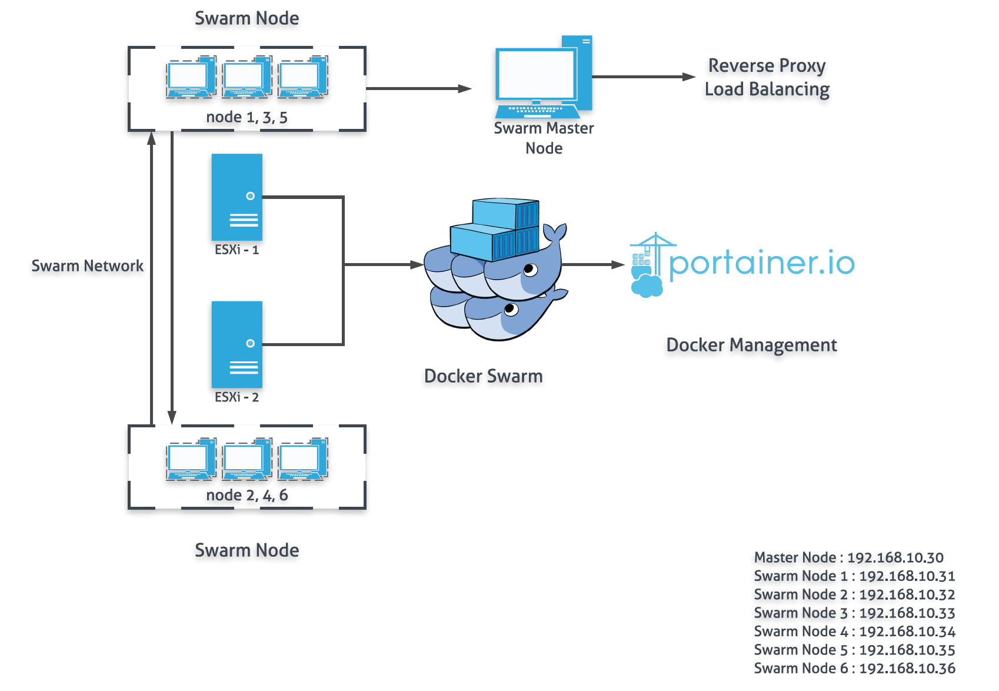

# Docker Swarm으로 시작하는 오케스트레이션 - 1 

* 2019년 현재 Docker는 빠질 수 없는 필수적인 구성 요소가 되었다. 

  

* 기존의 가상화 환경과 다르게 프로세스 격리 방식으로 동작하는 Docker의 경우 경량화는 물론 다른 Virtualizatin와 비교했을 때 빠른 Deploy가 가능하다는 여러 장점을 기존 시간에서 상세하게 설명하였다. 

* 이번시간에서는 실제 본 연구실에서 진행했던 Docker Swarm 오케스트레이션을 통한 GUI 오케스트레이션이라는 주제로 지필하고자 한다. 

  * 사실 오케스트레이션이라는 용어와 사용은 오래전부터 사용되어 있었다. 오케스트레이션이 무엇인지 살펴보고 싶다면 본 블로그에 Docker Swarms 편을 살펴보는 것을 추천한다. 

  * 현재는 거의 업계 표준이나 다름없이 사용되는 오케스트레이션 도구는 구글에서 제작한 **쿠버네티스**라고 할 수 있다. 

  * 하지만 본 연구실에서 쿠버네티스가 아닌 Docker Swarm으로 진행한 이유는 누구나 간단하게 오케스트레이션을 사용할 수 있으며, 관리의 용의성과 학습의 진행속도, 검증된 안정성이라는 장점 때문이다.

    * 그렇다고 해서 쿠버네티스가 안정성이 떨어지거나 하는 것은 아니다. 본 연구실에서 쿠버네티스를 도입했을 경우와 Docker Swarm을 도입했을 때의 여러 비용을 계산했을 때 Docker Swarm이 가장 적절하겠다는 본인의 판단에 결정에 따라서 진행하게 되었다. 

       


* Portainer GUI를 통해 Docker Container를 효율적으로 관리할 수 있는 오픈소스 도구이다. 
* 이미 Docker CLI가 익숙한 사람이라면 GUI가 필요없다고 생각할 수 도 있지만 본 연구실만 하더라도 Docker Swarm으로 오케스트레이션된 환경에서 수싶 수백게의 컨테이너를 CLI로 관리한다면 분명 불편할 것이다. 쉬운 관리와 각 서비스의 상태를 모니터링 할 수 있다는 점으로도 Portainer를 사용할 만한 가치는 충분하다고 할 수 있다. 


### 환경 구성하기 

* **Ubuntu 18.04 LTS 버전을 기준으로 설명한 점 참고 바란다.**

* 본 연구실에서는 2대의 ESXi가 운영되고 있다. 각 사양은 다르지만, 1,3,5는 ESXi 1번, 2,4,6은 ESXi2번으로 기본 설정을 진행하였다. 각각 Swarm 노드를 분리한 이유는 오케스트레이션의 장점을 최대한 활용하기 위한 최소한의 노력이라고 생각하는 것이 좋다. 만약 한 서버에 집중되어 서비스 한다면 장애대응에 심각한 문제를 야기할 수 있을 것이다. 

  * 최근에는 **DC/OS**를 사용하는 것이 추세로 자리잡고 있기 때문에 본 연구실에도  **DC/OS**의 시범 운영을 준비중에 있다. 
  * **DC/OS**가 무엇인지에 대해서는 다음에 자세히 알아보도록 하자. 

* Ansible을 통해 총 6대의 Worker Node에 기본 설정과 Docker 설치를 진행하였으며,  Master Node는 최근에 출시된 SBC 보드인 LATTEPANDA Alpha 864를 사용했다. 

  

  * 기존에 출시된 LATTEPANDA는 Intel Atom를 사용하는데 반해서 Alpha 864 모델의 경우 Intel 7th M3-7y30이 기본으로 장착, 8GB RAM, EMMC 5.0 스토리지를 사용하고 있는데 M.2 슬롯이 내장되어 있기 때문에 추가 스토리지를 장착하여 더 빠른 속도로 사용할 수 있다. 

  * 또 하나의 장점이라면 기존 버전에 비해 리눅스 사용이 상당히 매끄럽게 진행된다는 점이다. 기존 버전에서는 우분투가 정상적으로 동작하지 않거나 오류가 발생하는 경우가 많았으나 이번 버전에는 연구실에 본격적으로 도입한 후 2달동안 아무 문제없이 사용할 수 있었기 때문에 상당히 만족스럽게 사용하고 있다. 

     

* Docker Swarm에서 Master Node와  Node를 분리한 경우는 Master Node에 설치된 Portainer를 통해 최악의 상황에서 모든 ESXi 서버가 다운되었을 때 Master Node까지 사용 불능이 되는 상황을 막기 위함이었다. 

* 본 환경을 다시한번 정리하자면 다음과 같다.

  

  * 세부적으로 보면 오해의 소지가 있을 수 있는데 조금 자세히 살펴보자면 총 7대의 서버가 Docker Swarm으로 오케스트레이션 환경으로 구축되어 있으며, Master Node에서만 Portainer가 설치되어 있고 Swarm Node(Worker Node)에 Portainer Agent가 설치되어 있다고 생각하면 된다. 
  * Portainer에 대한 자세한 설명은 다음 시간에서 자세히 살펴보도록 하고, 일단 이렇게 구성되어 있다는 점만 기억하고 넘어가도록 한다. 

  

### Docker Swarm 설정

**본 설명은 Docker의 대한 기본적인 지식과 이해력이 있다고 가정하에 설명한다. 물론 따라하면 설치는 가능하다.**

* 먼저 Docker Swarm에서 Master Node를 설정해야 한다. 

  ```bash
  $ sudo docker swram init
  
  Swarm initialized: current node (bvz81updecsj6wjz393c09vti) is now a manager.
  
  To add a worker to this swarm, run the following command:
  
      docker swarm join \
      --token SWMTKN-1-3pu6hszjas19xyp7ghgosyx9k8atbfcr8p2is99znpy26u2lkl-1awxwuwd3z9j1z3puu7rcgdbx \
      172.17.0.2:2377
  
  To add a manager to this swarm, run 'docker swarm join-token manager' and follow the instructions.
  ```

  * 실제 나오는 명령어는 위와 다를 수 있으나 하나의 명령을 통해서 Master Node에 대한 설정이 완료되었다. 

* 이제 Worker Node를 설정한다. 미리 설정한 Worker Node에 명령어를 복사하면 된다.  

  ```bash
  $ sudo docker swarm join --token $(token) $(ip-address)
  ```

  * 본인은 총 6대의 Worker Node를 만들었기 때문에 6대의 서버에 동일한 작업을 수행하면 된다. 
  * 이렇게 하면 Docker Swarm 구성이 완료되었다!! 아주 간단하다. 

* 만약 추가적으로 Worker Node를 추가하는 등의 경우에 token 값을 모른다면 다음 명령을 통해 확인 할 수 있다. 

  ````bash
  $ sudo docker swarm join-token manager
  
  To add a manager to this swarm, run the following command:
      docker swarm join --token $(token) $(ip-address)
  ````

* 마지막으로 정상적으로 Docker Swarm이 설정되어 있는지 확인한다. 

  ```bash
  $ sudo docker node ls 
  ID                            HOSTNAME            STATUS              AVAILABILITY        MANAGER STATUS      ENGINE VERSION
  uko1380pqj4lwyivfm57icqb3 *   docker-swarm        Ready               Active              Leader              18.09.6
  vugg8c4enmnh79k3fbk3uc8pr     swarm-1             Ready               Active                                  18.09.6
  9sfmnq2hvphtlhv13grlnbhlv     swarm-2             Down                Active                                  18.09.6
  uo1zyi9elm3btqjl3fwh77r28     swarm-3             Ready               Active                                  18.09.6
  i7lklkwtuipxm974cvayrab3c     swarm-4             Down                Active                                  18.09.6
  lnu45st8fuwepeo8saye0rdbo     swarm-5             Ready               Active                                  18.09.6
  phz62z8ml8db5mcye5mxdguh1     swarm-6             Down                Active                                  18.09.6
  ```

  * 위에서 볼 수 있듯이 각각의 Worker Node가 정상적으로 등록된 것을 확인할 수 있으며, Woker Node가 죽어있다면 Down으로 표기된다. 
  * 정상적으로 위의 명령을 실행했다면 Worker Node 모두 Ready 상태로 등록되어 있을 것이다. 


### Portainer 구성하기 

* Portainer 구성 역시 Docker Swarm 만큼 아주 간단하게 사용할 수 있다. 
  * Portainer도 유료 버전이 존재하는데, 이를 사용하면 좀더 다양한 Extensions을 사용할 수 있다는 장점이 있다. 
  * 하지만 무료 버전을 사용한다고 해도 거의 모든 기능을 사용할 수 있기 때문에 크게 신경쓰지 않아도 된다. 

* 먼저 Master Node에 Portiner을 설치한다. 

  ```bash
  $ sudo docker volume create portainer_data
  $ sudo docker run -d -p 9000:9000 --name portainer --restart always -v /var/run/docker.sock:/var/run/docker.sock -v portainer_data:/data portainer/portainer
  
  ```

  * 만약 Portainer의 초기 admin 비밀번호를 설정하고 싶다면 다음을 통해 진행 할 수 있다. 

    ```bash
    $ htpasswd -nb -B admin <password> | cut -d ":" -f 2
    $ docker run --rm httpd:2.4-alpine htpasswd -nbB admin <password> | cut -d ":" -f 2
    
    $ docker run -d -p 9000:9000 -v /var/run/docker.sock:/var/run/docker.sock portainer/portainer --admin-password='암호화 비밀번호'
    ```

* Master Node에 정상적으로 설치가 되었다면 웹프라우저 9000번 포트를 통해 확인할 수 있다. 

* 하지만 우리는 Master Node에만 설치했기 때문에 Worker Node에서는 사용할 수 없다. 이를 위해 추가적으로 Agent 설치 과정을 진행해야 한다. 

  ````bash
  $ curl -L https://downloads.portainer.io/portainer-agent-stack.yml -o portainer-agent-stack.yml
  $ docker stack deploy --compose-file=portainer-agent-stack.yml portainer
  ````

* 초기 설정이 완료되었다. 일부 설명이 빠진 부분이 있긴 하지만 화면을 따라서 진행한다면 충분히 설정 가능할 것이다. 

* Portainer 초기 화면에서 Dashboard -> Go to cluster visualizer로 접속하면 다음과 같은 화면을 볼 수 있다. 

  


