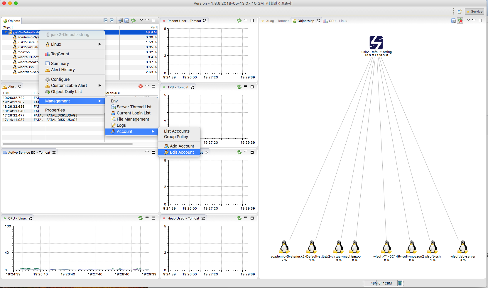
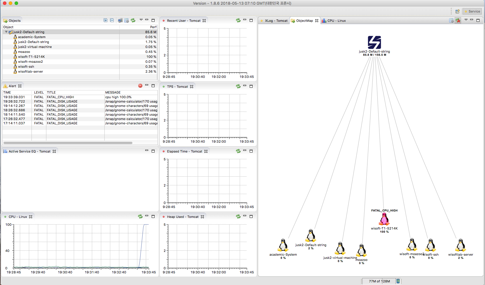

# SCOUTER 간단 사용설명서  

### scouter overview  

* scouter는 LG CNS에서 개발한 APM(Application Performance Monitoring) 도구 입니다. 
* APM은 애플리케이션의 성능을 모니터링하고  통제할 수 있는 도구로서 여러 도구들이 존재합니다. 
  * Stagemonitor
  * Pinpoint 
  * MoSKito 
  * Glowroot 
  * Kamon
  * scouter 
* 외산, 국내에서 개발된 오픈소스 APM Tools가 많이 있으며, 사용자의 입맛에 맞게 선택하여 사용할 수 있습니다. 
* scouter는 다음 깃허브 링크에서 다운로드 받아서 사용할 수 있으며, 기본적인 사용방법이 간단하다는 장점이 있습니다. 
  * https://github.com/scouter-project/scouter
* Windows, Mac OS X, Linux와 같은 다양한 OS를 지원하며, 데이터 수집을 위해 Agent 설치가 필요합니다. 


### Monitoring Target 

* 현재 scouter는 자바 어플리케이션을 대상으로 성능 수집이 가능합니다.
  * Tomcat, JBoss, Resin ...
* 또한 다음 운영체제에 성능 모니터링도 제공하여 어떤 임계치에 도달했을 때 UI에서 어떤 PC에 문제가 생겼는지 알려줍니다.
  * Linux, Windows, Unix 


### Plugins 

* scouter는 공식 플러그인도 제공하고 있는데 이러한 플러그인을 사용하여 다양한 기능을 추가적으로 사용할 수 있다는 장점을 가지고 있습니다. 

#### Sample 

* scouter-plugin-server-null 
  * 샘플 플러그인에서 수집한 데이터를 출력합니다. 

#### Alert 

* scouter-plugin-server-email 
* scouter-plugin-server-telegram
* scouter-plugin-server-slack 
* scouter-plugin-server-line 
* scouter-plugin-server-dingtalk 
  * 위와 같은 플러그인을 사용하여 메신저에 스카우터에서 발생되는 알람을 전송하여 확인할 수 있습니다. 


### Modules 

* **Agent**는 수집된 성능정보는 서버로 전송하는 역할을 담당합니다. 
* **Java Agent(JVM Agent)** 는 JVM이나 웹 어플리케이션 서버(Tomcat)과 같은 정보를 전송합니다. 
* **Host Agent(OS Agent)** 는 리눅스, 윈도우, 맥 OS과 같은 성능정보를 전송합니다. 
* **Server (Collector)** 는 각 Agent로 부터 수집된 데이터를 저장하는 역할을 담당합니다.
* **Client (Viewer)** 는 데이터를 보여주는 역할을 담당하며 RCP를 기반으로 제작되었습니다.  


### Setup  

#### Collector Server Installation 

* 스카우트 서버에는 JDK 1.8 버전 이상이 필요합니다. 

* 설치하고자 하는 서버에 자바 버전을 다음과 같이 확인하세요.

  ```bash
  $ java -version 
  java version "1.8.0_171"
  Java(TM) SE Runtime Environment (build 1.8.0_171-b11)
  Java HotSpot(TM) 64-Bit Server VM (build 25.171-b11, mixed mode)
  ```

  * 자바가 설치되어 있지 않다면 다음 명령을 통해서 자바를 먼저 설치합니다. 

    ```bash
    $ sudo add-apt-repository ppa:webupd8team/java
    $ sudo apt update
    $ sudo apt install oracle-java8-installer -y 
    ```

* 다음 링크를 참조하여 스카우터의 최신 릴리즈를 다운로드 받습니다. 

  * https://github.com/scouter-project/scouter/releases

  ```bash
  $ wget https://github.com/scouter-project/scouter/releases/download/v1.8.6/scouter-all-1.8.6.tar.gz
  ```

* 다운받은 스카우터 압축파일을 풀고 다음과 같이 실행합니다. 

  ```bash
  $ tar -xvf scouter-all-1.8.6.tar.gz
  & cd ./scouter/server
  ./startup.sh
  
   ____                  _
   / ___|  ___ ___  _   _| |_ ___ _ __
   \___ \ / __/   \| | | | __/ _ \ '__|
    ___) | (_| (+) | |_| | ||  __/ |
   |____/ \___\___/ \__,_|\__\___|_|
   Scouter version 0.0.1 ${date}
   Open Source Performance Monitoring
   System JRE version : 1.7.0_51
  ```

* 위와 같이 서버가 실행되고 백그라운드에서 실행됩니다. 

* 기본적으로 서버는 TCP/UDP 포트 6100번에서 실행합니다. 

* 만약 기본 설정을 바꾸고 싶다면 다음과 같이 설정 파일을 변경하세요. 

  ```bash
  $ cd scouter/server/conf
  $ vi scouter.conf
  
  # Agent Control and Service Port(Default : TCP 6100)
  net_tcp_listen_port=6100
  
  # UDP Receive Port(Default : 6100)
  net_udp_listen_port=6100
  
  # DB directory(Default : ./database)
  db_dir=./database
  
  # Log directory(Default : ./logs)
  log_dir=./logs
  ```

* 서버의 모든 설정은 클라이언트의 **Collector -> Configure** 에서 변경가능합니다. 

#### Host Agent Installation 

* 호스트 에이전트를 실행하기 위해서는 JDK 1.6 이상 버전이 필요합니다. 

  * 서버를 설치한 것과 같이 자바 버전을 확인하고 설치가 되어 있지 않다면 자바를 먼저 설치해 주세요. 

* 다음 링크를 참조하여 프로그램을 다운로드 합니다. 

  * https://github.com/scouter-project/scouter/releases

  ```bash
  $ wget https://github.com/scouter-project/scouter/releases/download/v1.8.6/scouter-all-1.8.6.tar.gz
  ```

* 다운받은 파일의 압축을 풀고 다음 경로로 들어가서 파일을 수정해 줍니다. 

  ```bash
  $ scouter/agent.host/conf
  $ vi scouter.conf
  
  ### scouter host configruation sample
  net_collector_ip=127.0.0.1
  net_collector_udp_port=6100
  net_collector_tcp_port=6100
  cpu_warning_pct=80
  cpu_fatal_pct=85
  cpu_check_period_ms=60000
  cpu_fatal_history=3
  cpu_alert_interval_ms=300000
  disk_warning_pct=88
  disk_fatal_pct=92
  ```

* **net_collector_ip** 는 반드시 서버의 IP를 입력해 주셔야 합니다. 

* 기본설정을 사용하신다면 주석만 해제해 주시면 됩니다. 

* 다음과 같이 호스트 에이전트를 실행합니다. 

  ```bash
  $ cd scouter/agent.host
  ./host.sh
  ```


#### Client Installation 

* 클라이언트를 실행하기 위해서는 JDK 1.8 이상이 설치되어 있어야 합니다. 

* 클라이언트 파일은 윈도우, 리눅스, 맥 OS X를 지원합니다. 

* 파일은 다음 링크를 참조해서 다운로드 받으시길 바랍니다. 

  * https://github.com/scouter-project/scouter/releases
  * [**scouter.client.product-linux.gtk.x86_64.tar.gz**](https://github.com/scouter-project/scouter/releases/download/v1.8.6/scouter.client.product-linux.gtk.x86_64.tar.gz)
  * [ **scouter.client.product-macosx.cocoa.x86_64.tar.gz**](https://github.com/scouter-project/scouter/releases/download/v1.8.6/scouter.client.product-macosx.cocoa.x86_64.tar.gz)
  * [**scouter.client.product-win32.win32.x86.zip**](https://github.com/scouter-project/scouter/releases/download/v1.8.6/scouter.client.product-win32.win32.x86.zip)
  * [**scouter.client.product-win32.win32.x86_64.zip**](https://github.com/scouter-project/scouter/releases/download/v1.8.6/scouter.client.product-win32.win32.x86_64.zip)

   

* 클라이언트를 실행하면 로그인 화면이 나오게 되고 기본 아이디와 비밀번호는 admin / admin 입니다. 

* 관리자 비빌번호를 변경하려면 다음을 참고 하세요. 

  

* 특정 호스트가 과부화 상태가 걸리거나 이상 증상이 생기는 경우 다음과 같이 표시됩니다. 

  

  

* 이상으로 오픈소스 APM의 간단 사용 설명서를 마치고 다음 시간에 자세한 사용 설명을 올리도록 하겠습니다. 

